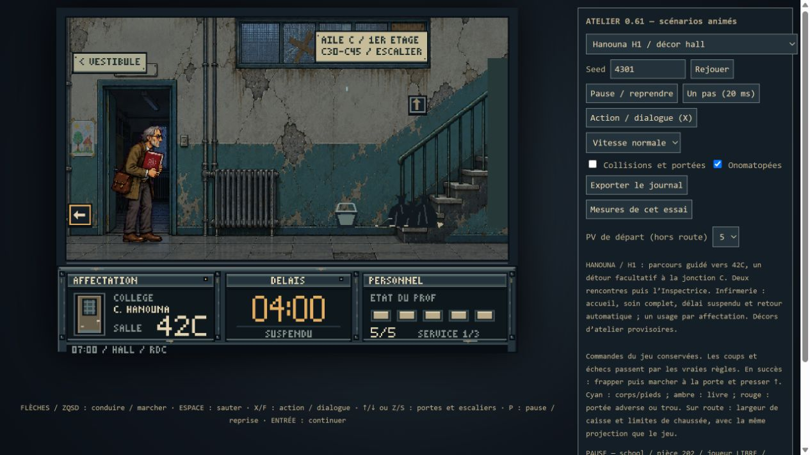

# Hanouna H1 — premier atelier de navigation

Premier lot de la [conception validée](CONCEPTION-HANOUNA-INSHAPE.md), après
la validation humaine de Bruel A3. H1 apprend à lire un établissement : suivre
une aile et un étage, puis reconnaître un détour de soin facultatif.

## Jouer localement

Ouvrir **Jouer-Technoprof-Atelier-Hanouna-H1.html**, dans le dossier du projet.
Le HTML contient le programme et les images, sans serveur ni réseau requis
(environ 101 Mo). Il démarre sur « Hanouna H1 / découverte du collège ».

Depuis les sources : `npm run build:atelier`, puis `npm run dev` et
`/?essai=labo&scenario=hanouna-navigation-h1`.

- Découverte : départ dans la cour, 5 PV par défaut, adversaires réels.
- Route puis collège : `hanouna-navigation-h1-road`, cruising puis affectation.
- Jonction et soins : `hanouna-navigation-h1-care`, deux premières rencontres
  déclarées terminées, PV de départ réglables pour isoler le détour.
- Inspectrice : `hanouna-navigation-h1-boss`, présentation et combat réels.
- Départs « décor » : inspection de chaque zone avec ses accès réels.

Flèches/ZQSD, Espace, F/X, souris et gestes tactiles restent les commandes.
Le bouton Action de l'atelier affiche puis avance les répliques ; « Un pas »
permet l'inspection en pause. Exporter le journal après l'essai.

## Parcours et règles

Cour ↔ vestibule ↔ hall ↔ grand escalier ↔ palier C ↔ galerie C30–C41 ↔
jonction C42–C45 ↔ seuil 42C. La jonction offre l'unique bifurcation vers
l'infirmerie. Neuf zones au total, huit sur le parcours direct. Aucun trou.

Le parent est dans le vestibule, l'élève dans la galerie, l'Inspectrice devant
42C. Leurs PV d'origine sont conservés : 3, 2, 6. Les ennemis ordinaires utilisent
la cadence plus vive déjà validée dans A3. Aucune nouvelle attaque ni hausse de PV.
Les retours gardent les rencontres terminées ; l'arène verrouille la sortie.
Victoire → porte 42C → « Bon. Reprenons. » → ellipse → voiture.

L'infirmerie intervient après les deux premières rencontres. Entrer réserve
son unique utilisation et suspend le délai jusqu'à la sortie. L'infirmière
accueille le professeur, trois pages se lisent avec Action ; soin complet,
sortie automatique vers la jonction. Le coût reste le détour spatial.
Une seconde visite ne relance ni dialogue ni soin.

Les 240 secondes et le trajet de la première affectation restent inchangés.
L'équilibrage global attend la réunion des trois établissements et de la conduite.

## Rendu de l'atelier

Fonds existants français des années 1970, panneaux physiques vers l'aile C,
un escalier ouvert, une porte d'infirmerie alignée sur son accès et sa scène
avec l'infirmière. L'étage est indiqué explicitement. La vue en hauteur du
palier est encore schématique ; hall et escalier partagent provisoirement
un fond. Les panoramas distincts, raccords architecturaux fins et landmarks
définitifs restent pour le lot de rendu, après l'essai de navigation.

## Vérification et essai humain

`npm run test:hanouna-h1` vérifie 90 connexions par les vrais contrôles,
18 séquences de soin et 12 parcours complets avec combats et ellipse,
au clavier et par pointage, à 30/60/120 fps. Les séquences de soin couvrent
PV 1/3/5, pause, focus, reprise du délai et seconde visite. Le rendu vérifie
les neuf compositions, plaques, frames chargées et nettoyage des objets.
Résultats : [rapport H1](work/hanouna-h1-results.json).

Les suites du jeu publié, A1/A2/A3 et le rendu A3 passent. Vérification native
du hall, de la montée, du palier, de la galerie, de la jonction, de l'infirmerie
et de 42C ; passage par pointage, lecture de l'accueil et retour soigné observés.
Aucune nouvelle erreur ou alerte dans la console du navigateur de cette passe.
Cela ne remplace pas la compréhension humaine du lieu ni l'essai tactile physique.

Pour le court test : faire un premier parcours sans plan, puis expliquer
grossièrement où sont l'aile C, l'étage, 42C et l'infirmerie. Le panneau du hall
doit suffire à orienter ; le soin doit être identifiable comme un détour.
Un second parcours doit permettre de retrouver volontairement la jonction,
de choisir le détour ou de le laisser, et de revenir sans hésitation inutile.

Bruel A3 et le HTML 0.61 gelé restent intacts. Branche
`atelier-navigation-bruel-a3`, sans publication sur main ou Pages.
InShape I1 est le prochain lot après cet essai H1.
