# Lycée professionnel Tibo InShape — atelier I1

I1 implémente la [topologie validée](CONCEPTION-HANOUNA-INSHAPE.md), dans un
profil isolé. La journée et le HTML 0.61 publiés, Hanouna H1 et Bruel A3 gardent
leurs graphes et leur équilibrage. La branche d'atelier est
`atelier-navigation-bruel-a3`.

## Jouer

- Local : ouvrir `Jouer-Technoprof-Atelier-InShape-I1.html`, généré par
  `npm run build:atelier`.
- Serveur : `npm run dev -- --port 4174`, puis
  `http://127.0.0.1:4174/?essai=labo&scenario=inshape-navigation-i1`.
- Clavier : ZQSD/flèches, Espace pour sauter, F/X pour frapper ou avancer une
  réplique ; Z/S ou haut/bas pour les accès en profondeur.
- Souris/touch : commandes directes existantes, marqueurs d'accès et gestes.

Les scénarios `-road`, `-care`, `-boss` et `-service` permettent de reprendre
respectivement depuis la voiture, la galerie, la Sécurité et le sol dangereux.
Les vues des carrefours sont également disponibles dans l'atelier. Les PV de
départ sont réglables ; ils ne modifient pas la mission publiée.

## Ce qui est maintenant jouable

17 zones, trois escaliers réversibles vers le même premier étage, six points
de décision. La cour distribue l'atelier, le passage couvert et le service.
L'atelier rejoint un vestiaire ou le préfabriqué de vie scolaire, impasse courte
et clairement nommée. Les trois montées se reconnectent à la galerie et à la
jonction T, avant la liaison, la préparation, le sas et T03.

- Route scolaire : parvis → accueil → couloir → escalier → galerie → jonction
  → liaison → préparation → sas → T03. Six rencontres.
- Route ateliers : parvis → accueil → cour → atelier → vestiaire → jonction,
  puis même fin. Six rencontres.
- Coupe connue : accueil → cour → passage couvert → vestiaire → jonction.
  Une zone et une rencontre évitées, cinq rencontres sur l'affectation.
- Service : cour → service → palier service → galerie → jonction. Cinq
  rencontres ; quatre ruptures sur le trajet complet, toutes hors combat.

Huit emplacements de combat restent actifs ; les adversaires de Jonction T et
Préparation T sont remplacés par des ruptures de sol. L'élève du sas est désormais
une lycéenne de terminale : dossier jaune, veste prune, sac à dos et quatre poses
propres. Elle réclame les mois de cours perdus faute de remplaçants et évoque
Parcoursup avant de barrer le passage. Son interception garde les règles de
l'attaque courte de l'élève : anticipation, saut ou recul pour l'éviter, puis
reprise punissable. La main est maintenue 0,20 s ; l'impact se situe au torse.
Les paramètres de portée, dégâts, PV et agressivité restent les mêmes.

Cinq zones comportent un trou : escalier principal, Jonction T, Préparation T,
passage de service et palier de service. Toutes sont en pièce calme,
séparées des accès et des points de retour, avec une plaque SOL FRAGILE ou
PLANCHER CORRODE. Marcher dans le vide déclenche une chute, une perte d'un PV,
puis un retour sur la même rive ; on peut sauter dans les deux sens.

Les adversaires
ordinaires reprennent le rythme validé d'A3 ; la Sécurité garde ses six PV,
sa garde frontale, sa poussée et son retournement. Sauter derrière elle permet
de punir son changement d'orientation. Aucune nouvelle attaque ni ressource.
Les combats terminés ne recommencent pas au retour.

Depuis la modification validée du 6 octobre, l'infirmerie se rejoint depuis la
Galerie T01-T02 et retourne dans cette même galerie. L'accès est distinct du
palier de service et du grand escalier. La galerie conserve son vigile ; son
combat ne recommence pas au retour du soin. Depuis le vestiaire, on peut revenir
de Jonction T vers la galerie pour visiter l'infirmerie.
Accueil, soin complet, répliques
avec Action, scène et transitions hors chrono, sortie automatique, une visite
utile par affectation. Le chrono reste celui de la mission actuelle (210 s) ;
son réglage global avec la conduite attend les essais humains.
Le bilan de fin identifie cet essai comme une seule affectation I1 : un cours
réussi n'affiche pas une radiation pour n'avoir testé qu'un service sur trois.

## Rendu de travail

Cette livraison sert à tester le parcours avant les nouvelles planches : elle
réutilise les pixels des ateliers. Seule la lycéenne du sas possède une nouvelle
planche imagegen ; source et prompt : `art/catchup-student-i1/`. Les accès et
escaliers sont recomposés avec des cadres provisoires, tous aux mêmes gabarits.
Les plaques indiquent les voisins, l'étage et les plages de salles. Pas de minimap.
La flèche à proximité conserve la convention de contrôle déjà apprise.

Repères : tuyau jaune coudé et rafistolé entre service, palier et galerie ;
casiers orange entre vestiaire et jonction ; pilier bleu à l'étage ; cuve du
château d'eau et auvent dans la cour. Les fenêtres de l'étage montrent des
toitures sous leur appui. L'infirmerie reprend le fond H1 et son infirmière
aux proportions corrigées. Les poses du boss sont ramenées au gabarit des
pièces ordinaires. La rupture de métal utilise encore le trou en gravats
existant : son illustration définitive attend la passe d'assets I1.

Le rendu n'est donc pas final : les murs réutilisés, les ouvertures schématiques,
les machines, les vues croisées et le délabrement propre à chaque zone devront
être remplacés par les compositions définitives après validation du LD.

## Vérification et essai humain

`npm run test:inshape-i1` vérifie le graphe approuvé, les sources de rencontres,
222 connexions par commandes réelles, 18 soins complets uniques, 60 sauts et
chutes dans les deux sens, 24 parcours complets avec ennemis actifs et ellipse.
Les cas sont exécutés à 30/60/120 FPS, clavier et pointage. La présentation
vérifie recadrages, nettoyage, pool fixe, proportions et ordre sol/trou/lèvre.
Les comptes rendus se trouvent dans `work/inshape-i1-results.json`.
L'interception de la lycéenne est vérifiée dans les deux orientations à
30/60/120 FPS : dialogue arrêté, saut/recul, un seul dégât, préparation
interrompue par le livre, maintien de pose et pause.

Passe après essai humain (journal 10) : parcours principal sans chute, tous les
PV jusqu'au boss, fin à 3/5 avec environ 154 s. Les nouvelles ruptures restent
en pièces calmes ; le raccourci couvert conserve son avantage de maîtrise.
Observation native supplémentaire : lycéenne en dialogue et en interception,
proportions avec le professeur, trou de l'escalier principal, descente masquée
par le bord, retour sur la même rive et dégât unique. Console sans erreur.

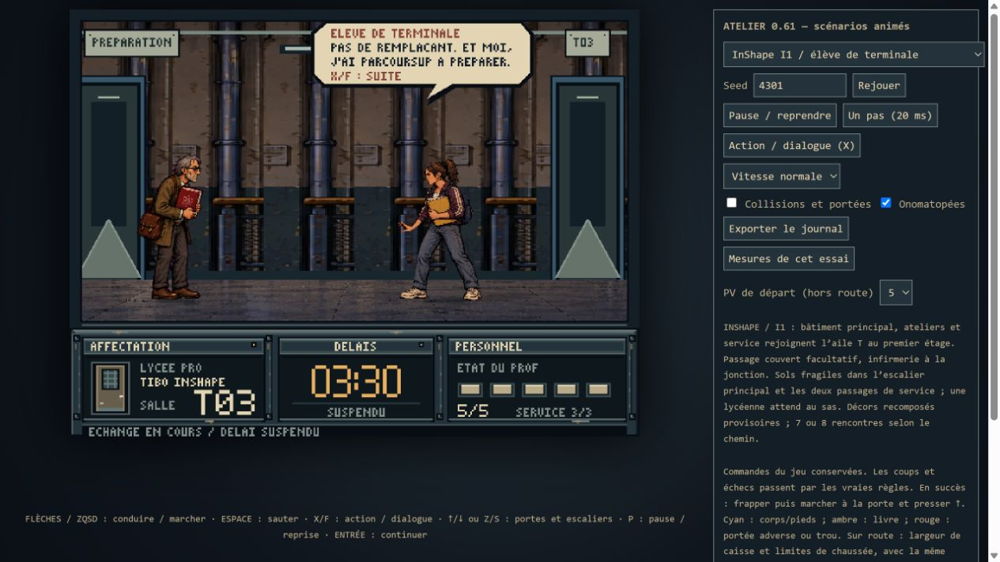
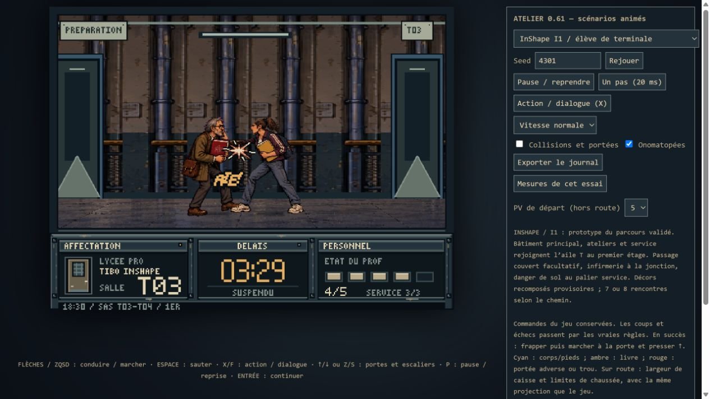
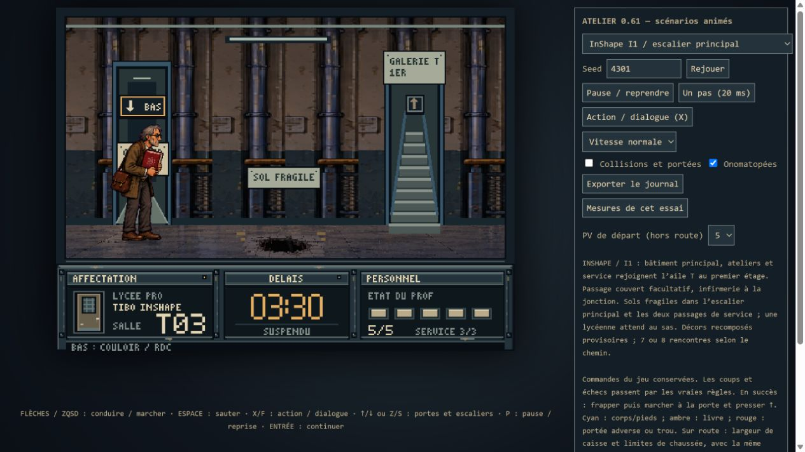

Amendement du 6 octobre : contrôle natif des quatre accès de la galerie,
entrée par pointage dans l'infirmerie à 3/5 PV, dialogue par Action et retour
automatique dans la galerie à 5/5 PV. Le délai reste à 209,60 s pendant le
dialogue, puis reprend lors du retour. Jonction T et Préparation T sont
observées sans ennemi, avec une rupture au centre du sol et les accès dégagés.
Console du navigateur sans avertissement ni erreur.

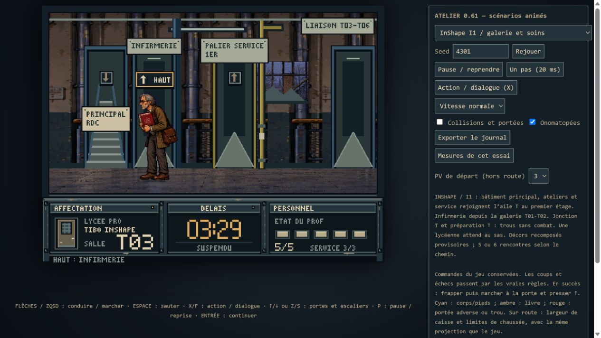
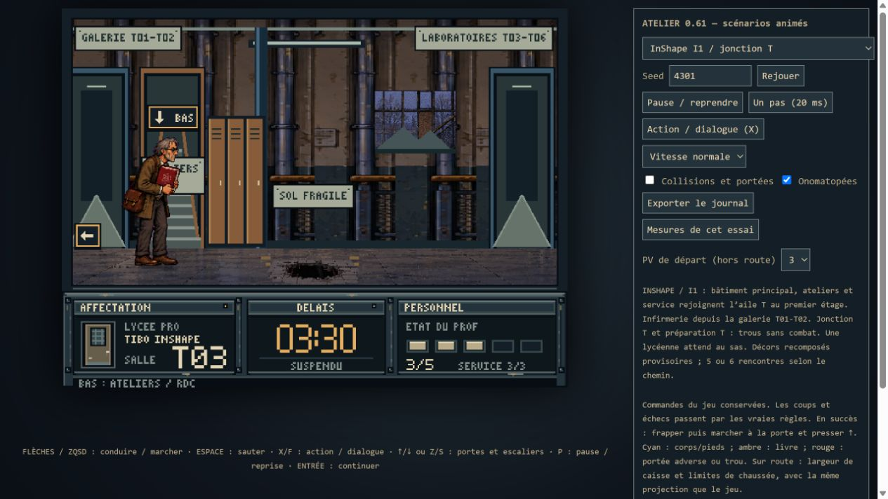
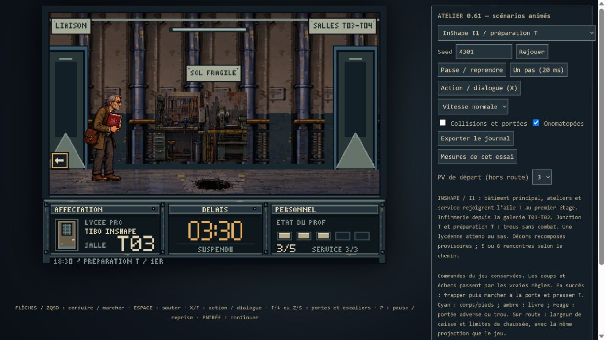

Vérification native initiale dans le navigateur : cour → service et passage couvert →
vestiaire par pointage,
lisibilité des carrefours et du trou, entrée réelle dans l'infirmerie depuis
la jonction puis retour automatique par Action, horloge suspendue pendant la
scène. Les fonds provisoires et les proportions sont observés avec personnages.

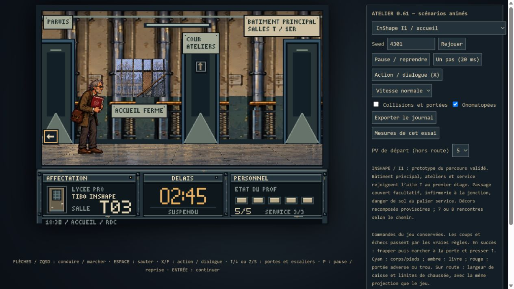
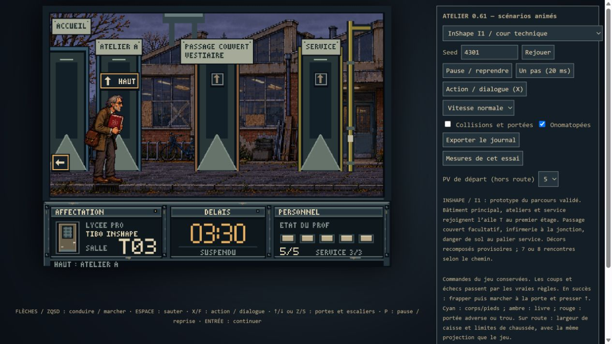
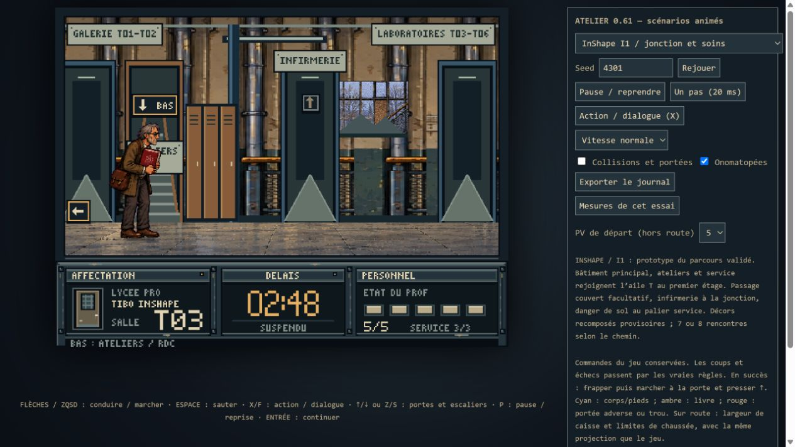
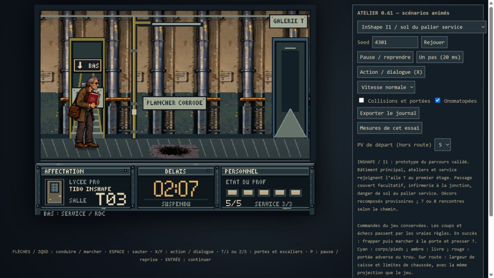
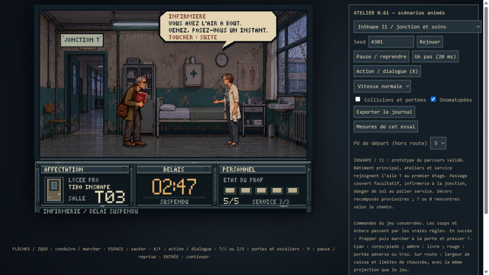
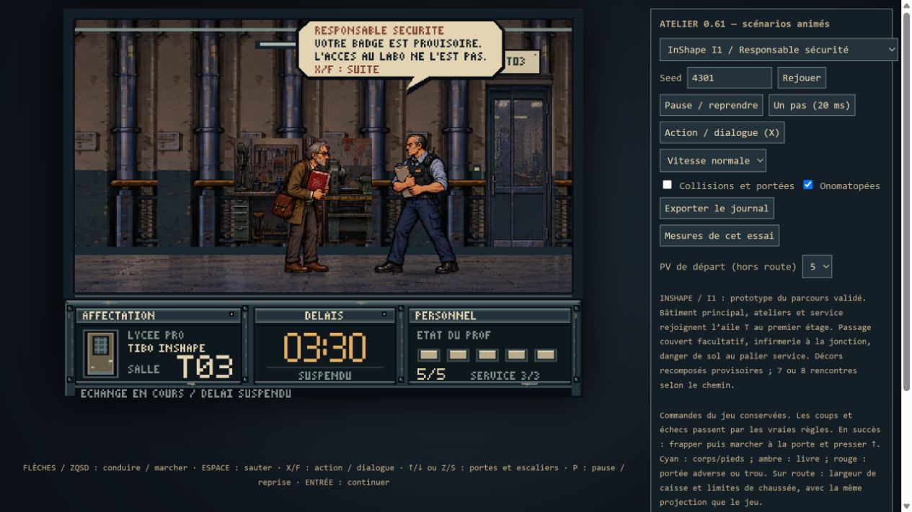

Ces résultats de bot ne prouvent ni difficulté humaine ni carte mentale.
Tester d'abord sans lire les routes ci-dessus, puis refaire un trajet :

1. Pouvoir situer l'accueil, la cour, les ateliers et l'aile T.
2. Reconnaître la jonction depuis une autre arrivée.
3. Choisir consciemment le passage couvert au second essai.
4. Comprendre où mène l'escalier de service et anticiper son sol fragile.
5. Corriger une visite au préfabriqué sans se sentir piégé.

Après ces retours : ajustements locaux de lecture, puis rendu définitif I1,
et seulement ensuite réintégration de la journée et chrono commun avec la route.
