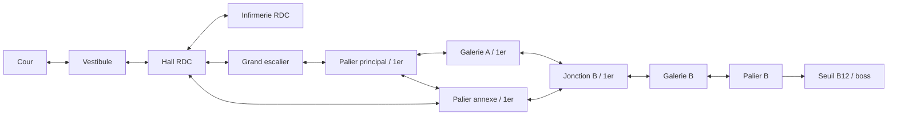

# Bruel A2 — densifier les décisions

**Statut : implémenté dans le profil d’atelier A2, le 3 octobre 2026.**
Branche `atelier-navigation-bruel-a2`. A1 reste sélectionnable et sa branche
`atelier-navigation-bruel` est conservée. La 0.61 publiée n’est pas concernée.
Voir `ATELIER-BRUEL-A2.md` pour lancer le jouable et conduire la comparaison.

Le retour sur A1 valide la lisibilité, mais son parcours principal indique trop
souvent la prochaine direction. Il faut rendre utile la connaissance du lieu,
sans agrandir le lycée, ajouter des adversaires ou rendre les accès obscurs.

## Un changement de graphe précis

Ajouter une liaison réversible **palier principal ↔ palier de l’annexe**,
au premier étage. Les douze zones et les deux escaliers sont conservés.
Le tableau de l’annexe représente désormais son palier supérieur : la montée
depuis le hall est portée par le passage hall → annexe, la descente par son
retour. Le tuyau cuivre et la jonction restent les repères de la seconde route.



A1 a deux zones avec au moins trois sorties : hall et jonction. A2 en a quatre :
hall, palier principal, annexe et jonction. Ce compte décrit le graphe ; il ne
prouve pas que les quatre choix seront intéressants à jouer.

Le joueur arrivé par le grand escalier peut continuer par la galerie A ou
changer de route par l’annexe. Celui arrivé par l’annexe peut retrouver le
palier principal et reconnaître la fenêtre sur la cour. Un mauvais choix
ouvre une possibilité de correction locale au lieu d’imposer le retour au hall.

Les six rencontres restent communes à tous les parcours vers B12. La liaison
n’offre pas de contournement d’un combat. L’infirmerie reste une impasse
optionnelle, le boss garde la classe et le cours conserve son ellipse.

## Réduire le guidage répété, garder les accès lisibles

- L’affectation annonce B12, aile B, premier étage. Le joueur connaît son but.
- Au hall, le grand escalier garde sa position dominante et son identification
  institutionnelle. L’annexe reste annoncée et secondaire, jamais cachée.
- Les panneaux intermédiaires nomment les lieux proches, les niveaux et les
  plages de salles ; ils ne répètent plus « B12 par ici » à chaque tableau.
- Au palier, les deux passages sont visibles simultanément : « Galerie A /
  traversée des ailes » et « Annexe / passage intérieur ». Aucun ne se présente
  comme une erreur ou comme le chemin optimal.
- Les touches et cibles tactiles restent explicites près des accès. La difficulté
  porte sur le choix du passage, pas sur la découverte du contrôle.
- Le panneau administratif garde la destination, le délai et le lieu actuel.
  Les aides de passage donnent une action et un nom local, sans itinéraire.

La fenêtre et le banc de la cour sont conservés. L’annexe doit être recomposée
comme un palier avec descente visible : garder le visuel de son ancien RDC tout
en annonçant « premier étage » introduirait une incohérence.

## Comparaison contrôlée

Conserver vitesses, timer, six adversaires, soin +1/+2 et douze zones. Ne pas
ajouter simultanément de danger, de salle fermée surprise ou de pénalité.
Comparer les deux tentatives et la correction d’une erreur ; un temps final
plus long n’est pas un indicateur suffisant de recherche de chemin.

Le modèle entre ancres donne :

| Parcours | Visites | Marche seule | Écart par rapport au principal |
|---|---:|---:|---:|
| Grand escalier → galerie A | 10 | 28,141 s | — |
| Grand escalier → palier → annexe | 10 | 26,518 s | −1,623 s |
| Annexe depuis le hall | 8 | 24,694 s | −3,447 s |

Les coûts des deux parcours A1 sont conservés exactement dans ce modèle,
ainsi que les détours de soin. Le nouvel embranchement permet un gain partiel
en cours de route ; l’annexe prise au hall reste la route la plus courte.
Ces chiffres excluent combat, hésitation, fondus et fenêtres d’interaction.
Ils ne constituent pas une validation en jeu.

Le diagnostic vérifie aussi les retours, l’accessibilité des douze zones,
les changements explicites de niveau, l’absence de piège avant le boss,
les six rencontres obligatoirement communes et le véritable plus court chemin
en tenant compte des positions d’entrée.

```sh
node work/propose-navigation-a2.cjs
node work/check-bruel-navigation-design.cjs bruel-navigation-a2-design.json bruel-navigation-a2-measures.json
```

La **liaison supplémentaire et la représentation de l’annexe au premier étage**
ont reçu le feu vert. Tester maintenant sans plan : reconnaître le palier,
choisir une continuation, expliquer la reconnexion, corriger une erreur et
utiliser ce savoir lors de la seconde tentative. Les assets définitifs viennent
après ce test de navigation.
