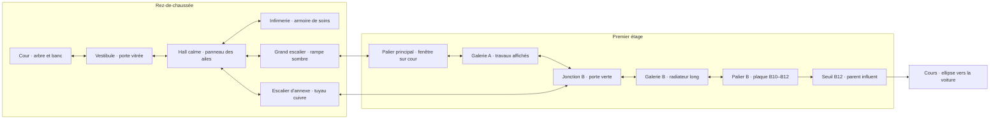

# Bruel — proposition spatiale sur la base 0.61

Statut : **proposition validée ; prototype isolé dans l’atelier A1**. Voir
[l’essai et ses vérifications](ATELIER-BRUEL-NAVIGATION.md). Le jeu publié
reste en 0.61. Ce document prépare un essai isolé dans l'atelier, sans remplacer
la mission de la journée. Référence : note de Noema,
`TECHNOPROF_Cadrage_navigation_orientation_0.61.md`, fournie par Nicolas.

## Ce que le joueur doit comprendre

B12 est dans l'aile B, au premier étage. Depuis le hall, le grand escalier donne
le parcours scolaire habituel. Un escalier d'annexe rejoint la même aile par
l'arrière. L'infirmerie est au rez-de-chaussée, près du hall. Aucun panneau ne
ment ; la meilleure route est moins évidente, mais ses indices sont disponibles
dès le premier passage. Reconnaître le hall et la jonction B permet de corriger
un choix sans repartir de l'entrée.

L'intérêt de la seconde tentative est de reconnaître la connexion de l'annexe,
de moins hésiter et de mieux décider si le détour pour se soigner est utile.
Il n'y a ni porte secrète, ni clé, ni quête, ni sortie déverrouillée arbitrairement.

## Périmètre et progression

- 12 zones significatives, rez-de-chaussée et premier étage uniquement.
- Deux routes rejoignent l'aile B ; une boucle permet le retour au hall.
- Six rencontres reprises de Bruel, communes aux deux routes. Pas d'ennemi ajouté.
- Hall, grand escalier, palier principal, galerie A, annexe et infirmerie calmes.
- Aucun trou sur ce premier essai : isoler la lecture du bâtiment, sans retoucher
  les obstacles de la mission publiée. Pas de scrolling dans cette première passe.
- Parent influent inchangé devant B12 ; retour en voiture par l'ellipse existante.

Les minima actuels **9 / 18 / 36 tableaux et 3 / 6 / 12 rencontres** restent ceux
de la journée 0.61. Les 12 zones proposées sont un banc d'essai spatial ; elles
ne constituent pas une nouvelle mission finale de 8 ou 10 tableaux. Avant une
intégration dans la journée, il faudra relire la relation entre zones et tableaux,
les quantités demandées, la durée et la difficulté. Ne pas rajouter une chaîne
de salles muettes pour rétablir mécaniquement le compte de 18.

La charge du parent influent conserve son défaut connu d'esquive. Sa correction
est un chantier distinct à terminer avant de tirer des conclusions sur la
difficulté du combat ou l'utilité obligatoire des soins.

## Graphe proposé

Les doubles flèches sont des passages réversibles. Le seuil B12 conserve le
cadrage de boss et son verrouillage actuel. Le dessin sert à la revue, pas de
minimap à afficher dans le jeu.

Boucle : hall → grand escalier → palier principal → galerie A → jonction B →
escalier d'annexe → hall. Les deux escaliers montent d'un seul niveau ; aucune
sortie latérale ne change implicitement d'étage. L'infirmerie est un cul-de-sac
volontaire avec un retour indiqué, jamais une étape imposée.

## Lecture des choix

Au hall, panneau unique à trois lignes : **AILE B / B10–B12 — GRAND ESCALIER**,
**ANNEXE — ESCALIER B**, **INFIRMERIE — RDC**. Chaque ligne est liée visuellement
à son accès ; les flèches suivent les positions réelles, pas un texte générique.
Le hall est assez calme pour que l'on puisse lire en marchant ; aucune pause
forcée ne doit imposer cette lecture.

Au pied de l'escalier d'annexe : **1er ÉTAGE / AILE B**. Cette confirmation rend
la route courte utilisable dès la découverte. À la jonction B : **B10–B12**,
**GALERIE A / GRAND ESCALIER**, **ANNEXE / RDC**. L'arrivée par l'une ou l'autre
route montre la même porte verte et le même tuyau : le joueur comprend la
reconnexion. Sur les retours, conserver les noms des lieux ; éviter « RETOUR »
seul, qui ne dit pas où l'on revient.

Dans l'aile A, les plaques A01–A04 disent où l'on est, mais le panneau de liaison
indique B10–B12. Cela explique une traversée de l'aile A sans faire croire que B12
est une salle A. Ne pas inventer une convention universelle selon laquelle le
chiffre 1 de B12 signifierait nécessairement étage 1 : l'étage est écrit séparément.

Panneaux crème et ardoise, supports vissés ou peints, petits textes bitmap.
Pas de signalétique retournée par le miroir du décor. Une indication de direction
principale par sortie ; aucun bloc de texte flottant devant un visage. Les touches
et zones tactiles existantes restent des aides d'interaction près des accès.
La plaque B12 et le chronomètre du CADRE restent les références constantes.

## Fiches de zones

Identifiants de conception stables : `bruel-*`. Un mapping vers les identifiants
numériques du moteur suffira ; ne pas renuméroter les journaux historiques.
Les coûts ci-dessous sont des estimations de marche, hors combat, lecture et
fondu, issues de `PLAY.walk = 85` unités/s. Les ancrages du fichier de graphe sont
provisoires : les aligner aux portes réelles avant le prototype graphique.

### 01 — `bruel-cour` · Cour d'entrée · RDC

- Fonction/information : situer l'arrivée dans le lycée ancien ; l'arche mène au vestibule.
- Repère : arbre dénudé, banc réparé et façade en pierre ; ils reviendront par la fenêtre du palier.
- Signalétique/sorties : ENTRÉE sous l'arche à droite → vestibule ; pas de sortie extérieure jouable.
- Valeur/risque : première rencontre, élève repris du tableau 41 ; contexte et réplique à recontextualiser, pas de nouvel archétype.
- Coût : environ 3,3 s de traversée, puis combat ; entrée x20, sortie droite x298.
- Assets : Bruel fond 0 ; sprite élève existant. Nouveau : plaque d'entrée et vignette de cour réutilisée au palier, sans nouveau panorama.

### 02 — `bruel-vestibule` · Vestibule · RDC

- Fonction/information : passage extérieur/intérieur ; le hall se trouve au-delà de la porte vitrée.
- Repère : haute porte vitrée, radiateur en fonte, pierre de l'arche visible derrière.
- Signalétique/sorties : COUR à gauche ↔ cour ; HALL à droite ↔ hall.
- Valeur/risque : parent au téléphone repris du tableau 11 ; la confrontation précède la lecture du hall.
- Coût : environ 3,3 s hors combat ; passages latéraux, arrivées x20/x278.
- Assets : Bruel fond 1 et parent qui filme. Nouveau : deux plaques sobres, dessinées par le système bitmap.

### 03 — `bruel-hall` · Hall des ailes · RDC

- Fonction/information : choisir la route et décider du soin ; annoncer B12, étage 1 et annexe.
- Repère : panneau des ailes au-dessus d'un grand radiateur ; dessin d'élève intact près de la fuite.
- Signalétique/sorties : vestibule à gauche ; grand escalier x60 ; infirmerie x180 ; annexe à droite.
- Valeur/risque : respiration et décision ; aucun ennemi, trou ou événement bloquant.
- Coût : 0,5 s depuis x20 vers le grand escalier, 1,9 s vers l'infirmerie, 3,3 s vers l'annexe.
- Assets : hall calme, planche quiet fond 3, radiateur/seau existants. Nouveau : panneau hiérarchisé et patch d'accès à l'infirmerie ; vérifier que l'accès ne recouvre pas le radiateur.

### 04 — `bruel-escalier-principal` · Pied du grand escalier · RDC → étage 1

- Fonction/information : confirmer le changement de niveau, route habituelle vers l'aile B.
- Repère : rampe sombre, grande fenêtre ancienne, marche réparée visible en arrière-plan.
- Signalétique/sorties : HALL / RDC au pied x60 ; 1er ÉTAGE / AILES A–B sur la montée x250 → palier principal.
- Valeur/risque : montée lisible, calme ; marche décorative cassée sans collision trompeuse.
- Coût : environ 2,35 s de x50 à x250 ; montée par l'interaction actuelle.
- Assets : Bruel fond 2. Nouveau : panneau d'étage ; pas d'animation physique d'escalier.

### 05 — `bruel-palier-principal` · Palier principal · étage 1

- Fonction/information : confirmer « étage 1 » et rappeler la cour vue en entrant.
- Repère : fenêtre sur l'arbre et le banc de la cour ; même orientation du bâtiment.
- Signalétique/sorties : GRAND ESCALIER / RDC x60 ; GALERIE A / LIAISON B à droite.
- Valeur/risque : former la carte mentale ; calme, pas de fausse porte interactive.
- Coût : environ 2,9 s depuis x50 vers la galerie.
- Assets : Bruel fond 1 avec variation de plaque et cadrage de fenêtre. Nouveau : petit patch de vue sur cour ; conserver hauteur de porte et ligne de sol.

### 06 — `bruel-galerie-a` · Galerie A · étage 1

- Fonction/information : traverser l'aile ancienne vers B, distinguer appartenance et direction.
- Repère : travaux d'élèves encadrés avec soin, corniche abîmée et fenêtres anciennes.
- Signalétique/sorties : PALIER / GRAND ESCALIER à gauche ; LIAISON B10–B12 à droite ; plaques A01–A04 au mur, sans portes supplémentaires jouables.
- Valeur/risque : continuité d'une aile et anticipation de la jonction ; calme.
- Coût : environ 3,3 s.
- Assets : Bruel fond 1 ; cadres/dessin existants. Nouveau : série courte de plaques et un regroupement de travaux ; pas de texte décoratif illisible.

### 07 — `bruel-escalier-annexe` · Escalier d'annexe · RDC → étage 1

- Fonction/information : matérialiser la connexion courte hall ↔ aile B, sans téléportation d'étage.
- Repère : tuyau cuivre apparent et peinture vert sombre ; tuyau retrouvé à la jonction.
- Signalétique/sorties : HALL / RDC x60 ; 1er ÉTAGE / AILE B x250 → jonction B.
- Valeur/risque : raccourci spatial accessible dès le départ ; aucun risque caché, aucun ennemi supprimé par cette route.
- Coût : environ 2,7 s depuis x20 vers la montée.
- Assets : Bruel fond 2 et tuyauterie existante. Nouveau : variation locale de rampe/panneau pour distinguer cet escalier du principal.

### 08 — `bruel-infirmerie` · Infirmerie · RDC

- Fonction/information : ressource optionnelle repérée depuis le hall ; retour au même point d'orientation.
- Repère : armoire de premiers soins claire, lit étroit derrière le plan de marche, volet usé.
- Signalétique/sorties : INFIRMERIE sur la porte ; HALL / RDC x60 pour ressortir.
- Valeur/risque : arbitrage temps/santé, aucun ennemi ; pas de soin implicite à l'entrée.
- Coût : marche jusqu'à l'armoire x180, interaction 1,2 s, retour au hall ; supplément modélisé ci-dessous.
- Assets : matières du fond calme Bruel quiet 1, porte et radiateur existants. Nouveau : patch composé armoire + lit, occultant le tableau de classe pour que le lieu ne paraisse pas être une classe renommée. Aucun personnage infirmier ajouté au premier essai.

### 09 — `bruel-jonction-b` · Jonction des deux ailes · étage 1

- Fonction/information : reconnaître la réunion des routes et identifier B10–B12.
- Repère : porte verte et tuyau cuivre de l'annexe ; vue de corniche vers l'aile A.
- Signalétique/sorties : GALERIE A à gauche ; ANNEXE / RDC x90 ; B10–B12 à droite.
- Valeur/risque : confirmation du choix puis élève repris du tableau 13. Panneaux à voir avant sa zone d'approche ; la bulle ne les recouvre pas.
- Coût : 3,3 s depuis la galerie, 2,9 s depuis l'annexe, hors combat.
- Assets : Bruel fond 1, porte/tuyau réutilisés, élève existant. Nouveau : plaques de jonction et variation de porte ; garantir trois accès discernables.

### 10 — `bruel-galerie-b` · Galerie B · étage 1

- Fonction/information : confirmer l'arrivée dans l'aile demandée et la proximité de B12.
- Repère : long radiateur sous vitrage rafistolé ; plaques B08–B10.
- Signalétique/sorties : JONCTION / ANNEXE à gauche ; B10–B12 à droite.
- Valeur/risque : parent au téléphone repris du tableau 44 ; combat dans une circulation déjà comprise.
- Coût : environ 3,3 s hors combat.
- Assets : Bruel fond 1, parent existant, vitrage réparé existant. Nouveau : trois plaques alignées au mur ; pas de répétition d'affiches partout.

### 11 — `bruel-palier-b` · Palier B · étage 1

- Fonction/information : dernier repère de destination et annonce du contrôle devant B12.
- Repère : tableau d'emploi du temps sous vitre fendue, plaque B10–B12.
- Signalétique/sorties : GALERIE B à gauche ; B12 à droite ; aucune montée supplémentaire.
- Valeur/risque : agent de sécurité repris du tableau 47 ; ne pas cacher le seuil derrière sa bulle.
- Coût : environ 3,3 s hors combat.
- Assets : hall calme quiet 3, agent existant, accessoires papier/verre existants. Nouveau : patch de panneau d'affichage ; horaires suggérés par lignes, seul B12 doit être lisible.

### 12 — `bruel-seuil-b12` · Seuil B12 · étage 1

- Fonction/information : destination atteinte, dernière opposition avant le cours.
- Repère : porte B12 usée, poignée claire et parent influent reconnaissable.
- Signalétique/sorties : B12 sur la porte x281 ; porte accessible après victoire.
- Valeur/risque : boss actuel du tableau 14, même réplique et même cadrage fixe ; pas de sortie de combat ajoutée.
- Coût : environ 2,8 s de déplacement final depuis x45, plus combat.
- Assets : Bruel fond 3 et parent influent existants. Nouveau : plaque B12 correctement ancrée ; effets/charge corrigés séparément.

## Parcours et coûts

Parcours de découverte probable : cour → vestibule → hall → grand escalier →
palier principal → galerie A → jonction B → galerie B → palier B → seuil B12.
Le panneau B12 du hall attire vers le grand escalier ; le choix reste libre.

Parcours efficace : cour → vestibule → hall → escalier d'annexe → jonction B →
galerie B → palier B → seuil B12. Il gagne deux zones et un peu de marche, sans
éviter une rencontre. Son avantage doit rester modeste : apprendre le lycée
ne doit pas rendre le chrono sans intérêt.

Erreur récupérable : depuis la jonction, prendre GALERIE A / GRAND ESCALIER,
reconnaître le palier puis le hall, et remonter par l'annexe. Les panneaux de
retour annoncent réellement leur destination. Le joueur ne doit pas suivre une
flèche B12 pour être reconduit au rez-de-chaussée.

Les chiffres reproductibles sont dans [la mesure du graphe](work/bruel-navigation-measures.json).

| Route | Zones visitées, retours compris | Marche et soin estimés | Rencontres croisées |
|---|---:|---:|---:|
| Découverte par le grand escalier | 10 | 28,14 s | 6 |
| Annexe connue | 8 | 24,69 s | 6 |
| Grand escalier avec soin | 12 | 35,05 s | 6 |
| Annexe avec soin | 10 | 28,78 s | 6 |
| Mauvaise direction à la jonction, corrigée par le hall | 14 | 38,51 s | 6, sans réapparition |

L'annexe économise 3,45 s de marche. L'erreur proposée coûte 13,81 s par rapport
à cette route ; le détour de soin ajoute 6,91 s au grand escalier ou 4,08 s à
l'annexe. Ces valeurs faibles n'impliquent pas un chrono tendu : l'essai compact
peut avoir beaucoup de marge avec le budget de la mission longue. Ne pas retoucher
le délai de la journée pour rendre ce banc d'essai artificiellement difficile.

Ils ne comprennent **ni combat ni hésitation**, et ne prouvent pas un gamefeel.
Le modèle suit les points d'entrée et de sortie, à vitesse 85 unités/s ; les
fondu imposés restent hors chrono. Aucun délai de mission augmenté : Bruel
conserve 225 s, route comprise. Sur neuf références routières 0.61, il reste
environ 171 s après le trajet 2 ; c'est une mesure de bot anticipatoire, pas le
budget garanti d'un humain.

## Soin proposé, à régler dans le prototype

- Soin **+2 PV, plafond 5**, une fois par affectation ; valeurs centralisées.
- Interaction explicite avec l'armoire : F/X au clavier ou toucher de l'objet,
  sans commande nouvelle. Une discrète aide apparaît à portée.
- À vie pleine : « Rien à soigner », aucune consommation ni immobilisation.
- Soin bref, 1,2 s après validation : geste, son discret, segments de santé qui
  remontent et petite confirmation +2/+1. Pas de feu d'artifice ni nouveau HUD.
- Le soin volontaire et le détour consomment du délai ; les fondus forcés ne
  deviennent pas payants. Pause réelle suspend aussi le soin.
- Engagement du soin à la fin : vérifier délai, vie et état ; l'échec à zéro
  prévaut, aucun retour à la vie. Si une pause intervient, reprendre le même soin,
  sans répéter son gain. Revenir dans la pièce ne réinitialise pas son stock.
- Après usage : armoire ouverte avec compartiment vide, aide « Soins utilisés ».
  Ne pas transformer le délabrement en gag ni prétendre que le soin disponible
  signifie présence d'une infirmière : c'est un petit poste de premiers soins.

Le détour est accessible avant les quatre dernières rencontres. Son supplément
doit être perceptible mais modeste ; si tout le monde se soigne malgré une santé
élevée, ou si un passage blessé l'impose à tous, revoir le gain/coût et les combats.
Le gain provisoire de deux PV pour 4 à 7 s peut être trop rentable : le signaler
comme hypothèse à mesurer, pas comme équilibre validé. Comparer notamment +1 PV
et +2 PV dans l'atelier avant de choisir le montant intégré à une vraie mission.

## Assets et lisibilité à réaliser après revue

Pas de génération d'image pour cette conception. Les deux planches
[Bruel](art/bruel-backgrounds-057.png) et [zones calmes](art/quiet-backgrounds-059.png)
ont été inspectées : leurs matières et proportions sont adaptées. Le hall à
plusieurs accès, la jonction et l'infirmerie demandent cependant des patches
fonctionnels ; du texte seul ne suffit pas à changer la nature d'une pièce.

Lot minimum proposé : signalétique bitmap sur supports, patch d'accès hall,
patch de jonction, poste de soins, fenêtre sur cour, rampe d'annexe et panneau
de palier. Réemployer dessins, seau, tuyaux et radiateurs. Ne pas retourner les
écritures ni copier des façades nord-américaines. Fond à sol mat, portes de même
gabarit, pieds à y159. Aucun objet interactif ne se confond avec une affiche.
Les coins de décor restent calmes ; un landmark principal par zone suffit.

## Impacts techniques ciblés

1. `src/missions.ts` possède déjà `RoomSpec`, sorties, destination, spawn,
   labels, rencontres et décor. Adapter ce modèle pour un profil Bruel d'atelier
   explicite plutôt que disperser des tests sur l'identifiant dans `main.ts`.
2. Mapper les identifiants de conception vers des IDs numériques propres au
   profil. Éliminer pour ce profil le repli silencieux vers une salle Hanouna
   quand un ID est inconnu : échouer en atelier plutôt qu'afficher le mauvais lieu.
3. `missionPassages` reste la source unique pour clavier, souris et tactile.
   Décrire tous les retours et leurs spawns ; protéger l'absence de double passage
   sur touche maintenue. Ne pas empiéter sur les marqueurs/cibles tactiles.
4. `NewSchoolArt` sait choisir fonds/variantes mais applique aujourd'hui un rendu
   de porte lié aux scènes existantes. Rendre les patches d'accès explicites dans
   les données pour hall/jonction, sans développer un éditeur de niveau.
5. Conserver `enterRoom`, le cache `roomEnemies`, les répliques non rejouées et le
   fondu 0,12 + 0,18 s hors délai. Ce cache protège déjà le retour sans respawn ;
   le soin doit avoir son propre état par affectation, distinct des ennemis.
6. Ajouter une interaction de ressource seulement en infirmerie, prioritaire
   sur frappe quand le prof est à portée. Aucun combat dans cette pièce ; un clic
   sur l'armoire devient intention d'approche puis soin, avec le même arrêt sûr
   que les passages. Ne pas simuler le soin via un ennemi ou une porte de cours.
7. `SessionLog` enregistre déjà les entrées, dégâts et temps par catégorie.
   Ajouter choix de sortie, identifiant stable, durée active par zone, visites,
   soin prévu/confirmé et PV/délai aux points d'entrée, sans compteur visible en
   permanence. Séparer temps de lecture, combat, marche, pause et fondus.

Estimation relative : graphe atelier et tests de sorties, petit lot ; adaptation
de l'art aux trois accès et interactions de soin, lot moyen ; validation humaine
et tuning, lot indispensable. Pas de chiffrage calendaire sans prototype.
Pas de nouvelle dépendance, moteur, sauvegarde, pathfinding ou commande.
Export autonome et publication Pages doivent fonctionner avec le profil d'atelier.

## Validation et séquence de travail

La [vérification de conception](work/check-bruel-navigation-design.cjs) vérifie
IDs, destinations, spawns, retours, étages, accessibilité, soin optionnel, boucle,
routes et six rencontres communes. Elle analyse un **graphe de proposition**,
pas un système implémenté. Le fichier JSON n'est pas importé par le jeu.

Après revue : intégrer dans l'atelier seulement ; tester la boucle dans les deux
sens, la sortie de soin, la persistance des combats/soins, le timer, les entrées
simultanées, maintien, focus, 30/60/120 fps et gestes directs. Rejouer ensuite les
tests de la journée 0.61 pour détecter toute contamination du profil normal.

Essai humain : Bruel sans plan externe, puis seconde tentative avec même graphe.
Demander où se trouvent hall, annexe et B12 ; quels repères ont aidé ; pourquoi
une route a été choisie ; où une erreur a été corrigée. Comparer parcours, retours,
temps actif, PV et soin. Ne pas noter uniquement réussite/échec ou chrono final.
Faire aussi une tentative à PV diminués dans un preset annoncé, sans assimiler
ce preset à une découverte de mission normale. Le soin doit être vu comme choix.

Accepter si le joueur reconnaît la reconnexion, peut expliquer le chemin et le
refait plus efficacement, si une erreur est récupérable et si les panneaux sont
lus sur téléphone sans assistance. En cas d'échec, corriger le hall ou les repères
avant d'ajouter des zones. Une seule galerie scrollée pourra être comparée ensuite
si la continuité spatiale reste difficile à sentir, sans élargir tout le moteur.

**Revue attendue maintenant :** organisation à deux étages, annexe utilisable
dès le premier essai, six rencontres sur les parties communes, infirmerie au hall
et séparation de l'essai compact de la mission finale. Les détails de soin et
d'ancrage restent des paramètres de prototype, pas des décisions irréversibles.
