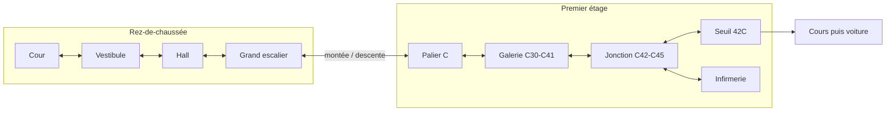
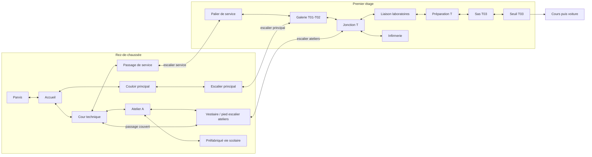

# TECHNOPROF — proposition spatiale Hanouna / InShape

**Statut : conception validée par Nicolas, 4 octobre 2026.**
Hanouna H1 est maintenant [jouable dans son atelier](ATELIER-HANOUNA-H1.md).
InShape I1 est validé pour le lot suivant, après le court essai humain H1.
Bruel A3 est la référence intermédiaire validée par Nicolas, avec ses combats,
son infirmerie et ses deux ruptures de plancher. Son graphe reste intact.
La journée publiée et le HTML 0.61 restent intacts.

Intention issue du cadrage fourni : **Hanouna apprend à lire un lieu → Bruel
demande de le comprendre → InShape demande de s'y débrouiller.** Les pourcentages
de guidage sont des intentions de lecture, pas des mesures calculables sur le graphe.

## Vue d'ensemble

| | Hanouna H1 en atelier | Bruel A3 validé | InShape I1 validé, à implémenter |
|---|---|---|---|
| Zones uniques | 9 | 12 | 17 |
| Parcours principal, sans soin | 8 zones | 10 zones | 10 zones |
| Choix locaux, hors simple retour | 1 | 4 : hall, palier, annexe, jonction | 6 : accueil, cour, atelier, vestiaire, galerie, jonction |
| Étages | RDC + premier | RDC + premier | RDC + premier, avec trois escaliers distincts |
| Valeur de la connaissance | Moins hésiter ; retrouver le soin | Annexe, raccords, soin | Couper par la cour ; reconnaître les trois arrivées vers l'aile T |
| Rencontres sur le trajet | 3, boss compris | 6 | 7 ou 8, boss compris — budget validé ci-dessous |

InShape possède davantage de connexions et de variantes, mais son premier
parcours ne traverse pas plus de tableaux que celui de Bruel. Chaque détour a
une destination et un repère : pas de chaîne de salles ajoutée pour atteindre un quota.

Les graphes et leurs routes sont également décrits dans
[le fichier de conception](work/etablissements-ld-proposition.json).
Il n'est pas importé par le jeu. Les noms `h-*` et `i-*` sont des identifiants
de conception ; les identifiants historiques des logs ne sont pas renumérotés.

## Hanouna H1 — un axe scolaire évident, un détour utile

### Graphe et connexions

Les doubles flèches sont réversibles avant le verrouillage de l'arène.
Après la victoire, ouverture de 42C puis ellipse existante ; aucun retour à pied.

### Zones, repères et informations

| ID | Zone et fonction | Landmark | Signalétique importante | Rencontre |
|---|---|---|---|---|
| h-cour | Situer le collège et entrer | Préau de béton, panier rouillé, même bouleau visible depuis le palier | ENTRÉE près de la porte | Calme |
| h-vestibule | Passer de la cour au bâtiment | Porte vitrée rafistolée, tapis décollé | COUR / HALL | Parent d'élève, source actuelle 1 |
| h-hall | Comprendre aile et étage | Grand panneau vissé, radiateur avec seau, escalier largement cadré | AILE C / 1er ÉTAGE / C30–C45 ; escalier | Calme |
| h-escalier | Lire la montée et son retour | Rampe tubulaire, marche réparée, bande jaune usée | HALL / RDC ; PALIER C / 1er | Calme |
| h-palier | Confirmer l'étage | Vue sur le préau et le bouleau en contrebas | 1er ÉTAGE / AILE C ; C30–C45 | Calme |
| h-galerie | Relier une plage de salles à une aile | Casiers verts cabossés, affiches scolaires déchirées | C30–C41 sur les portes ; C42–C45 vers la jonction | Élève, source 3 |
| h-jonction | Faire l'unique choix significatif | Porte d'infirmerie gris clair, chariot de ménage garé hors du passage | C42–C45 ; INFIRMERIE ; GALERIE C30–C41 au retour | Calme |
| h-seuil | Reconnaître exactement la destination | Porte 42C, vitrage armé rafistolé, plaque claire | 42C | Inspectrice actuelle, source 4 |
| h-infirmerie | Découvrir l'utilité d'un détour après les deux rencontres | Lit, couverture propre, infirmière, affichage de prévention | INFIRMERIE ; JONCTION C au retour | Soin facultatif |

Le hall, l'escalier et le palier ne sont pas trois couloirs équivalents :
ils enseignent respectivement la plage de salles, le changement d'étage et
la reconnaissance de la cour depuis un autre point de vue.

### Choix, parcours et maîtrise

**Premier passage probable :** cour → vestibule → hall → escalier → palier →
galerie → jonction → seuil 42C. La grande ouverture de l'escalier et les plages
de salles rendent cet axe naturel. L'unique bifurcation est à la jonction :
continuer vers les classes ou visiter l'infirmerie.

**Passage connu :** même axe, avec moins d'hésitation. À la jonction, décider
du soin selon ses PV. Ici, connaître le bâtiment n'exige pas de découvrir un
autre itinéraire : savoir où se trouve une aide et où l'on revient constitue
déjà une première maîtrise spatiale.

**Erreur corrigible :** entrer à l'infirmerie puis ressortir à la même jonction.
Le soin conserve l'accueil humain, le chrono suspendu, le soin complet et
l'usage unique validés dans A3. Une seconde visite permet simplement de revenir.
La porte est décalée de l'axe des classes pour éviter une entrée involontaire.

Pas de boucle ni de raccourci pour H1. Pas d'annexe, de deuxième étage ou de
passage dangereux concurrent. Ces anciennes branches du collège restent dans
la 0.61 ; elles ne sont pas reprises dans ce nouveau profil d'apprentissage.
Pas de trou dans H1 : l'enjeu de cette première proposition est de comprendre
les accès, pas de superposer lecture et saut. Ce choix fait partie de la validation.

## InShape I1 — bâtiment principal, ateliers et circulation de service

### Organisation générale

Un accueil distribue le bâtiment principal et la cour technique. Deux familles
de parcours montent au même premier étage : l'escalier scolaire et l'escalier
des ateliers. Une troisième montée, par le service, retrouve la galerie T.
Les ateliers sont au RDC : hauts plafonds, grandes baies, vestiaire au pied
de leur escalier. Les laboratoires sont à l'étage, pas au-delà d'une cour
qui changerait implicitement de niveau.

### Zones, repères et informations

| ID | Zone et fonction | Landmark | Signalétique importante | Rencontre proposée |
|---|---|---|---|---|
| i-parvis | Situer le lycée professionnel | Grille, façade de béton, enseigne ancienne | ACCUEIL | Agent, source 61 |
| i-accueil | Choisir bâtiment ou cour | Guichet vitré fermé, panneau administratif riveté | BÂTIMENT PRINCIPAL / SALLES T ; COUR / ATELIERS | Calme après le parvis |
| i-couloir | Route institutionnelle | Néons incomplets, portes de bureaux, dalle fissurée | SALLES T / ESCALIER ; ACCUEIL au retour | Élève, source 64 |
| i-escalier | Monter par la route scolaire | Rampe bleue, fenêtre horizontale sur la cour | GALERIE T / 1er ; COULOIR / RDC | Calme |
| i-galerie | Première reconnexion | Baie sur les toits des ateliers, pilier bleu, grille d'aération rouillée | T01–T02 ; LIAISON T03–T06 ; SERVICE / RDC | Agent, source 67 |
| i-cour | Lire trois possibilités au sol | Château d'eau industriel visible au-dessus du mur, auvent de tôle rafistolé | ATELIER A ; VESTIAIRE / ESCALIER ; SERVICE | Calme |
| i-atelier | Traverser un vrai atelier ou choisir le préfabriqué | Machines bâchées, étau et établi hors du plan de marche | VESTIAIRE ; VIE SCOLAIRE / PRÉFABRIQUÉ | Élève majeur lanceur, source 21 |
| i-vestiaire | Comprendre le passage couvert et la montée | Rangée de casiers orange, bottes, manteaux de travail, pied d'escalier | AILE T / 1er ; COUR TECHNIQUE ; ATELIER A | Agent, source 25 |
| i-service | Accès peu confortable mais intelligible | Tuyau jaune de chauffage, cage d'escalier métallique visible | SERVICE / MONTÉE GALERIE T ; COUR au retour | Calme |
| i-palier-service | Retrouver le même étage par une autre arrivée | Même tuyau jaune, fenêtre haute, plancher métallique corrodé | 1er ÉTAGE / GALERIE T ; SERVICE / RDC | Calme, danger de sol existant adapté au matériau |
| i-jonction | Deuxième reconnexion et accès au soin | Pilier bleu de la galerie, casiers orange visibles dans la descente | T03–T06 ; GALERIE T01–T02 ; ATELIERS / RDC ; INFIRMERIE | Élève, source 73 |
| i-liaison | Reconnaître l'aile des laboratoires | Vitrages armés, affiches de sécurité déchirées, radiateur froid | T03–T06 ; JONCTION T au retour | Lanceur, source 70 |
| i-preparation | Situer la préparation avant les salles | Placard de matériel condamné, paillasse inutilisée hors passage | PRÉPARATION T ; SALLES T03–T04 | Agent, source 76 |
| i-sas | Dernière confirmation locale | Porte coupe-feu cabossée, boîtier de badge existant | T03–T04 ; LIAISON au retour | Élève, source 79 |
| i-seuil | Objectif et contrôle d'accès | Porte T03, pictogramme de labo et lecteur de badge | T03 | Responsable sécurité existant, source 24 |
| i-infirmerie | Respiration accessible depuis la jonction | Lit, drap propre, infirmière, réparations du lino | INFIRMERIE ; JONCTION T au retour | Soin facultatif, mêmes règles qu'A3 |
| i-prefab | Impasse logique, courte, permettant de se réorienter | Bardage fatigué, panneaux VIE SCOLAIRE, planning de salles local | RDC / VIE SCOLAIRE ; LABORATOIRES T / 1er ; ATELIER A pour revenir | Calme, aucun soin ni récompense ajoutés |

Le préfabriqué n'est pas présenté comme un chemin vers T03 : son nom est
lisible avant d'y entrer. Son planning rappelle le premier étage, sans
dessiner une carte ni dicter l'itinéraire. Une porte suffit pour revenir.

### Décisions, boucles et raccourcis

1. **Accueil :** bâtiment principal, visuellement prioritaire, ou cour.
2. **Cour :** grande porte d'atelier, passage couvert vers le vestiaire,
   accès de service. Le passage couvert est visible et nommé dès la première
   visite ; il ne s'ouvre pas après un événement et n'est pas une porte secrète.
3. **Atelier :** vestiaire ou préfabriqué clairement identifié comme vie scolaire.
4. **Vestiaire :** monter vers T, revenir par l'atelier ou rejoindre directement
   la cour. Ce raccord révèle que traverser l'atelier n'était pas obligatoire.
5. **Galerie T :** jonction, grand escalier ou descente de service. Le tuyau
   jaune évite de confondre cette descente avec l'escalier principal bleu.
6. **Jonction T :** continuer vers les labos, visiter l'infirmerie, revenir par
   les ateliers ou par la galerie. Les repères de ces deux arrivées coexistent.

Grande boucle : accueil → couloir → escalier principal → galerie → jonction
→ escalier ateliers → vestiaire → cour → accueil.
Petite boucle au RDC : cour → atelier → vestiaire → passage couvert → cour.
Boucle de service : cour → service → palier service → galerie → jonction
→ vestiaire → cour. Les trois montées sont explicites, réversibles et d'un
seul étage ; aucune porte latérale ordinaire ne change de niveau.

**Premier passage probable :** parvis → accueil → couloir → escalier principal
→ galerie T → jonction → liaison → préparation → sas → seuil T03.

**Découverte des ateliers :** parvis → accueil → cour → atelier → vestiaire
→ jonction → même fin. Cette variante crédible permet de découvrir le raccord.

**Parcours connu court :** parvis → accueil → cour → passage couvert → vestiaire
→ jonction → même fin. Il évite la traversée de l'atelier : une zone et une
rencontre de moins. La connaissance du lieu a ici une conséquence concrète,
sans clé ni capacité supplémentaire. La route scolaire reste parfaitement viable.

**Variante de service :** parvis → accueil → cour → service → palier de service
→ galerie T → jonction → même fin. Elle n'est pas le chemin le plus court en
nombre de zones ; elle offre une autre reconnexion et moins de combats, mais
un danger de sol dans une pièce calme. Le danger est visible avant le saut,
éloigné des portes et des points d'arrivée. Aucun trou en zone de combat.

**Erreur corrigible :** cour → atelier → préfabriqué → atelier → vestiaire.
Les combats terminés ne redémarrent pas au retour. Le soin depuis la jonction
reste un aller-retour facultatif, avec scène et fondus hors chrono, usage unique.

### Signalétique et hiérarchie

À l'accueil, les SALLES T sont associées à l'escalier principal ; le passage
vers la cour a une hiérarchie secondaire. Dans la cour, les trois accès sont
lisibles par leurs objets autant que par leurs plaques : grande porte atelier,
auvent vers vestiaire, tuyau jaune vers service. Pas de flèches « T03 » répétées.

Les lettres T ne codent pas l'étage à elles seules : **1er ÉTAGE** est affiché
séparément. Depuis les baies de l'étage, voir les toits des ateliers et la cour
en contrebas ; depuis le RDC, voir portes et pieds de façade. Les casiers orange,
le pilier bleu et le tuyau jaune sont aussi distinguables par leurs formes.

Limiter à trois directions de progression dans la cour, en plus du retour
à l'accueil. La jonction réserve quatre accès distincts, avec lecture de ses
plaques avant le dialogue ou après le combat, sans bulle sur les informations.
Les proportions des portes, pieds et escaliers doivent rester raccord.

## Arbitrage de la quantité de combats

Le code publié utilise encore `DAY_LOAD` : **9/18/36 tableaux** et
**3/6/12 rencontres minimales**. Cette proposition remplace les chaînes de
tableaux par des lieux ; elle ne prétend pas satisfaire automatiquement ces quotas.

Pour I1, je propose **10 emplacements de rencontres existantes**, sans nouveau
type, nouvelles attaques ni PV augmentés. Six sont communs à tous les parcours :
parvis, jonction, liaison, préparation, sas et boss. Deux sont sur la route
scolaire, deux sur la traversée complète des ateliers. Ainsi, le parcours
scolaire ou atelier compte huit rencontres, la coupe par le vestiaire et le
service sept. Le raccourci peut éviter une rencontre, à la différence du premier
banc d'essai Bruel où les six étaient communes.

**Le budget de 7–8 au lieu de 12 est validé avec cette proposition.**
Il sert à observer les choix sans réintroduire une fin interminable. Les sources
non retenues pour I1 restent dans la 0.61 ; aucune vague ni chaîne de couloirs
n'est ajoutée pour rejoindre l'ancien quota.

Hanouna conserve ses deux rencontres ordinaires et son Inspectrice. Son vigile
de l'ancienne branche n'est pas repris dans H1. Bruel reste entièrement inchangé.
L'agressivité et les patterns seront repris des systèmes existants, sans une
nouvelle passe d'équilibrage cachée dans le travail de navigation.

## Réutilisation des assets et périmètre technique

Réutiliser les professeurs, ennemis, infirmière, portes, mobilier et matériaux
appropriés. Les extérieurs de Hanouna restent ceux d'un collège français des
années 1970 ; InShape conserve le béton, les ateliers et les extensions techniques.
Ne pas recolorer le lycée ancien de Bruel pour fabriquer les deux autres.

Après validation : deux profils d'atelier isolés, avec zones et sorties explicites,
retours, dialogues, soin et traces de navigation existants. Le soin d'A3 doit être
rendu utilisable dans ces profils avec exactement les mêmes règles : c'est une
réutilisation, pas un nouveau système. Les coordonnées des accès se régleront
sur les fonds ; aucun gain en secondes n'est promis à partir du seul graphe.

Premier prototype avec fonds existants adaptés et repères fiables. Valider les
parcours avant de générer les planches graphiques définitives. Aucun scrolling,
inventaire, serrure, minimap, retour après le cours ou effet de chrono ajouté.
L'équilibrage du temps attend la réintégration du trajet en voiture.

## Validation avant rendu final

1. **H1 :** un premier joueur trouve 42C sans être perdu, reconnaît l'étage et
   sait retrouver l'infirmerie. Le détour ne ressemble pas à une sortie principale.
2. **I1 :** après une première tentative, pouvoir situer accueil, cour, ateliers
   et aile T ; reconnaître la jonction malgré une arrivée différente.
3. **Deuxième passage :** choisir consciemment le passage couvert, identifier
   la zone évitée et corriger une erreur depuis un carrefour local.
4. **Service :** comprendre où l'escalier monte, reconnaître le tuyau dans la
   galerie, voir le danger et disposer de place pour sauter dans les deux sens.
5. **Contrôles :** toutes les connexions fonctionnent dans les deux sens au
   clavier et par pointage/gestes, sans sortie involontaire ni réapparition ambiguë.
6. **État :** combats terminés conservés au retour ; soin complet unique ;
   pause/focus et fondus ne relancent ni dégâts ni chrono suspendu.

Les logs peuvent confirmer visites, raccords, PV et erreurs corrigées ; ils
ne prouvent pas seuls la carte mentale. Le test décisif reste l'explication
du lieu par le joueur et un second parcours plus conscient.

Vérification statique de la proposition : toutes les zones sont accessibles,
chaque connexion entre étages nomme un escalier, tous les itinéraires listés
suivent le graphe et les infirmeries sont facultatives avec un seul retour.
Les sources de rencontres existent dans les missions actuelles. Le graphe
confirme une bifurcation pour H1, six pour I1 et six rencontres communes à I1.
Ces contrôles ne constituent pas un test du jouable ni de la compréhension humaine.
Voir [le relevé statique](work/etablissements-ld-proposition-verification.json).

Ordre validé : **H1 jouable → essai humain court → I1
jouable → deux parcours humains → rendu propre aux deux établissements →
réintégration dans la journée et réglage global du chrono.**
