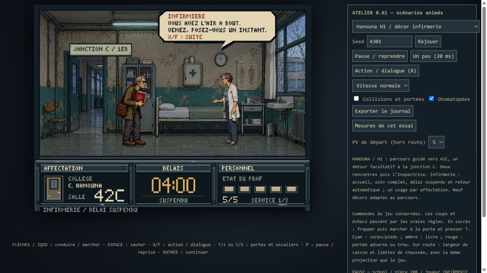
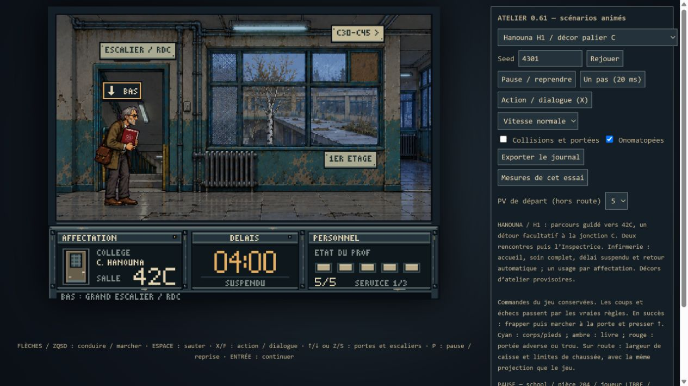
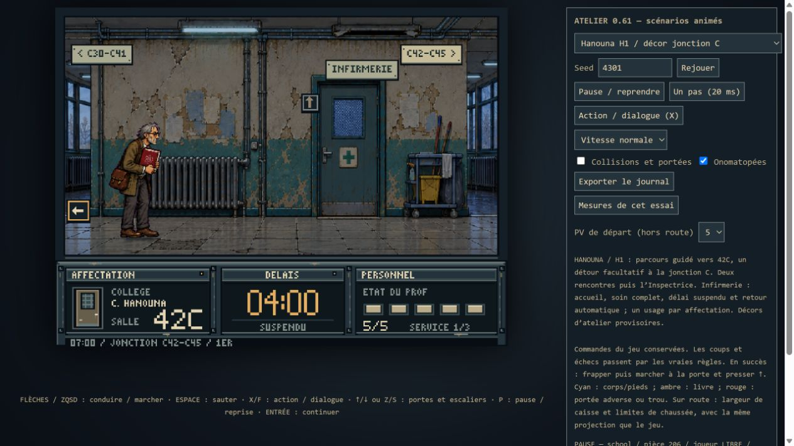

# Hanouna H1 — rendu adapté au level design

Passe de présentation après validation humaine du parcours. Elle ne modifie
ni graphe, ni PV, ni réglage de l'Inspectrice, ni agressivité ordinaire, ni
chronomètre, ni contrôles, ni scène de soin. Bruel A3 et la 0.61 gelée restent intacts.

## Neuf tableaux

| Zone | Repères et accès |
|---|---|
| Cour | Bouleau, préau en béton, banc ; entrée visible à droite |
| Vestibule | Baie vitrée réparée, panneau de vie scolaire ; cour à gauche, hall à droite |
| Hall | Affichage scolaire ; grand escalier ouvert, rampe verte |
| Escalier | Retour au hall à gauche ; montée vers le palier à droite |
| Palier C | Escalier descendant ; vue du bouleau et du préau depuis l'étage |
| Galerie C | Placards scolaires, portes C30 et C31 fermées ; passage traversant |
| Jonction C | Porte médicale et chariot d'entretien ; continuation vers 42C |
| Seuil 42C | Fenêtres à l'étage, dessin d'élève, porte et arène de l'Inspectrice |
| Infirmerie | Lit modeste, armoire, lavabo, linge propre ; respiration humaine |

Les fonds gardent le langage français des années 1970 : béton, menuiseries
métalliques vertes, peinture écaillée, réparations modestes, radiateurs et
néons fatigués. Les sols ne changent pas en plancher : ce collège ne partage
pas la construction ancienne du lycée Bruel. Aucun danger nouveau ni trou.

## Échelle et intégration

Le professeur garde son échelle intérieure de 0,18 dans la cour également.
L'arène abandonne son ancien agrandissement : les poses existantes y sont
réduites à 80 %, en gardant orientation et profondeur de l'entrée en classe.
L'infirmière passe de 77 à 86 pixels logiques de hauteur de texture : sa
silhouette utile rejoint les quelque 84 pixels du professeur debout. Son
ancrage sous les semelles est 0,986 ; les deux adultes reposent à y=163.
Le lit fait environ 92 pixels de longueur : proportions humaines, sans
mobilier géant. Les recadrages des fonds enlèvent les séparateurs des planches
et réduisent le premier plan excédentaire, sans écrire de PNG transformé.

Les plaques sont dessinées à coordonnées entières, montées au-dessus des
portes ou sur les murs. Les marqueurs Action restent ceux du gameplay validé.
L'animation de 42C utilise les dimensions de sa nouvelle porte, sans modifier
le déplacement du professeur ni le temps de transition. Les anciens patches
schématiques et les déchets génériques superposés à chaque tableau sont retirés.

## Assets et reproductibilité

Images créées avec l'outil imagegen intégré. Les sources PNG restent intactes.
[Prompts complets et provenance](art/hanouna-h1/PROMPTS.md).
Les variantes initiales sont conservées pour retrouver les décisions graphiques.
`node work/embed-hanouna-h1.cjs` reconstruit les trois sources embarquées ;
`npm run build:atelier` produit le jouable local autonome.

## Vérifications

`npm run test:hanouna-h1` : connexions réelles, soins uniques/complets avec
suspension et reprise du délai, combats complets, fenêtre de l'Inspectrice,
originalité et limites des neuf frames, échelle et ancrage de l'infirmière,
absence d'allocation d'images aux revisites, isolation des autres profils.
Les suites publiées, navigation A1/A2/A3 et rendu A3 doivent aussi passer.

Vérification visuelle dans le navigateur local des neuf tableaux avec les
personnages et interfaces réels. La lecture humaine du nouveau décor reste
à confirmer, ainsi que le confort sur écran de téléphone physique.

